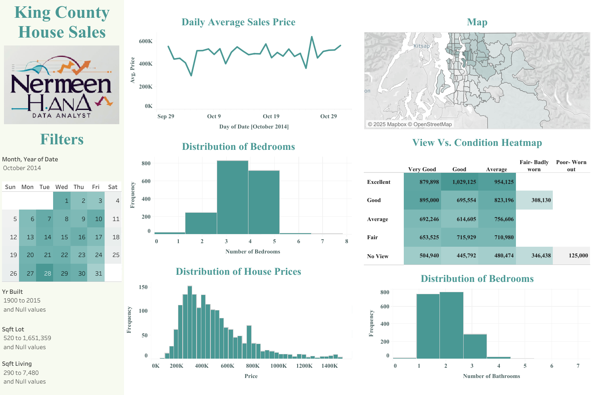

## 🏠 King County House Sales Dashboard

### 📝 Overview
An interactive Tableau dashboard analyzing house sales in King County, Washington.  
It includes key metrics and filters to explore property prices by location, date, number of bedrooms/bathrooms, square footage, and more.

### 🎯 Objectives
- Provide an interactive platform to explore housing market trends.  
- Visualize property prices geographically and over time.  
- Enable filtering by property characteristics and sales details.  
- Identify patterns and insights that can help buyers, sellers, and real estate analysts.

### 📂 Dataset
- **Source**: Public King County house sales dataset.  
- **Files Used**:  
  - `HouseData.xlsx` – Property sales data including prices, sizes, and other features.  
- **Size**: ~21,000+ property sales records.  
- **Key Fields**: Date, Price, Bedrooms, Bathrooms, Sqft Living, Sqft Lot, Floors, Waterfront, View, Condition, Grade, Yr Built, Latitude, Longitude.

### 🛠 Skills & Tools Used
- Tableau for interactive dashboard creation and visual analytics  
- Map charts for geographic insights  
- Line charts for market trends over time  
- Bar charts for property feature comparisons  
- Interactive filters and parameters for deeper exploration

### 📈 Key Insights
- Waterfront properties command significantly higher prices.  
- Seasonal trends show price peaks during summer months.  
- Larger living areas strongly correlate with higher prices.  
- Certain neighborhoods consistently outperform others in value growth.

### 🖼 Dashboard Preview

---

## 📬 Contact
If you’d like to discuss these projects or collaborate:
- **LinkedIn**: [Nermeen Hana](https://www.linkedin.com/in/nermeen-hana-6702a64b/)  
- **Email**: nermeenhana144@gmail.com
