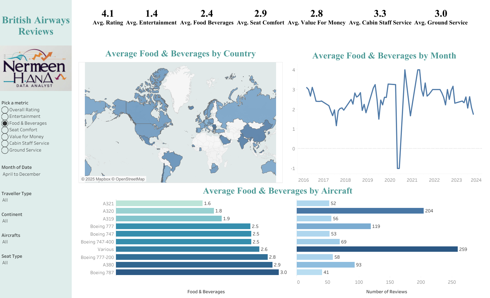

# 📊 Tableau Projects

This repository contains interactive Tableau dashboards created to visualize real-world datasets, uncover trends, and present insights through engaging visual stories.  
Each project demonstrates skills in **data preparation, mapping, trend analysis, parameters, interactive filters, and dashboard design**.

---

## ✈️ British Airways Reviews Dashboard

### 📝 Overview
An interactive Tableau dashboard analyzing British Airways customer reviews across multiple service aspects.  
It includes a variety of metrics and parameters that allow users to explore ratings by country, month, aircraft type, traveller type, seat type, and more.

### 🎯 Objectives
- Provide an interactive platform to explore customer satisfaction trends.
- Visualize ratings geographically, over time, and by aircraft type.
- Enable filtering by traveller demographics and travel details.
- Identify patterns and insights that can help improve service quality.

### 📂 Dataset
- **Source**: Publicly available British Airways customer reviews dataset.  
- **Files Used**:  
  - `ba_reviews.csv` – Customer review details including ratings for various service categories.  
  - `Countries.csv` – Country mapping for geospatial visualization.  
- **Size**: ~1,400+ review entries.  
- **Key Fields**: Country, Traveller Type, Continent, Aircraft, Seat Type, Date, Multiple Rating Metrics.

### 🛠 Skills & Tools Used
- Tableau for interactive dashboard creation and visual analytics  
- Map charts for geographic insights  
- Line charts for time-series trends  
- Bar charts for category comparisons  
- Interactive filters and parameters for custom exploration

### 📈 Key Insights
- Ratings vary significantly between aircraft types and routes.  
- Certain months and years show noticeable fluctuations in customer satisfaction.  
- Geographic trends reveal differences in ratings across continents and countries.  
- Traveller type and seat class play a role in overall satisfaction levels.

### 🖼 Dashboard Preview

---

## 📬 Contact
If you’d like to discuss these projects or collaborate:
- **LinkedIn**: [Nermeen Hana](https://www.linkedin.com/in/nermeen-hana-6702a64b/)  
- **Email**: nermeenhana144@gmail.com
